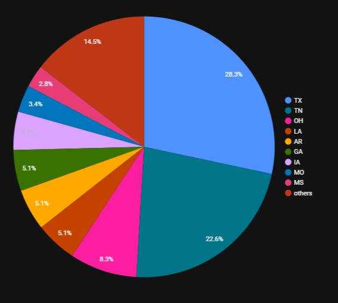
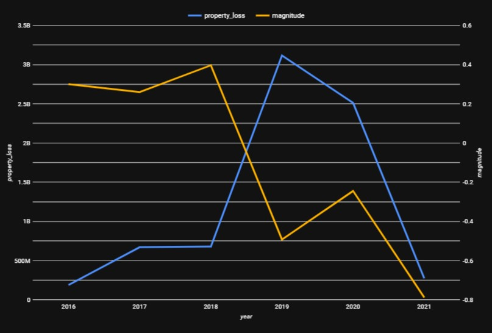
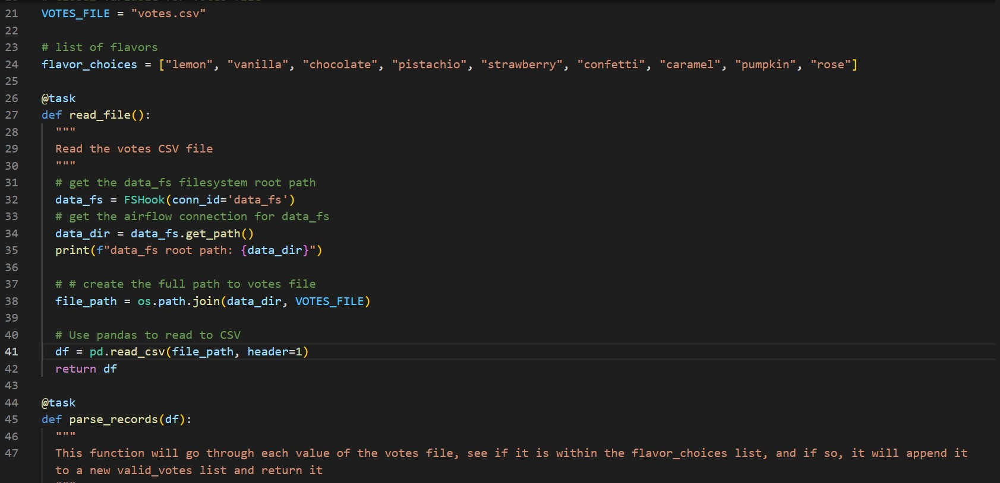

# Brief Intro:

#### Being born and raised in Silicon Valley, I've always been around the Tech Industry. After a career change from Audio Engineering, I finally decided to take a step into this ever-evolving landscape by beginning a new journey through Data Engineering. The following projects showcase some of the latest technologies used to build Data Engineering ETL Pipelines. 

## Team Week 3
This project was a group collabrative project with two other of my classmates. We each took datasets reloving around money, stock prices, and natural disasters and developed ETL pipelines using Python's Pandas library that was then automated using Airflow. I specifically developed the ETL pipeline that dealt with Tornado natural disasters and created visualizations with my analysies. 

 

## Data Modeling
This project uses Python's Pandas library to source data from a JSON file about airline tickets and create an ETL pipeline that includes dimension and fact tables. The end products are uploaded to Google's BigQuery.

## Airflow 2 
This project utilizes key Airflow features to create a DAG based around a CSV file. The key features include using sensors that check for the existance of the CSV file, Xcoms that will transfer outputs in between different DAG tasks, and Decorators which will help make the code that constructs the tasks and DAG to be more concise.

## Team Week 2
This project was also a group collabrative project with two other of my classmates where we took various datasets revolved around crime data in various cities across the U.S. and created a ELT pipeline. We used Python's Pandas library to extract our data from CSV files and loaded them to Google's BigQuery. Then we used dbt to preform all our transformations. My contributions dealt with the cities of Portland and Boston. 
